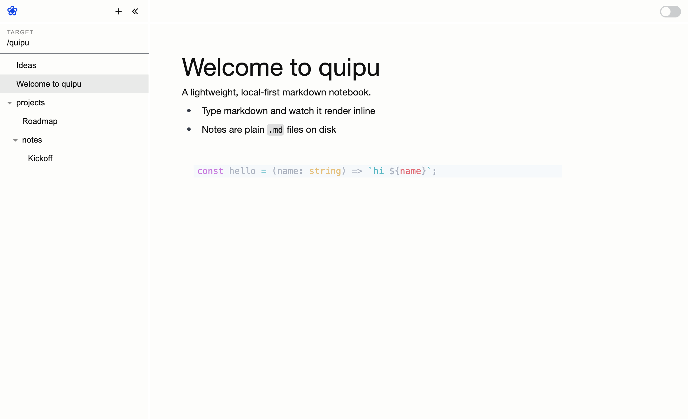

# quipu ❀

A lightweight, local-first markdown notebook. Your notes are just plain `.md`
files in a folder you choose — quipu is a fast, brutalist editor and browser
over them.



## Features

- Inline WYSIWYG markdown (GitHub-flavored) with code syntax highlighting
- Collapsible file tree; drag to reorder or drop into folders (order persisted in SQLite)
- Drag-and-drop / paste images — stored in a hidden `.assets/` folder and auto garbage-collected
- Preview ↔ raw-markdown toggle
- Live filesystem sync (external edits show up instantly)
- Pick any target directory; each remembers its own note order

## Run (dev)

Requires [Node](https://nodejs.org) and [Rust](https://rustup.rs).

```bash
npm install
npm run tauri dev
```

Notes default to `~/.quipu` (change the target from the sidebar).

## Build

```bash
npm run tauri build
```

Outputs `quipu.app` and a `.dmg` under `src-tauri/target/release/bundle/`.

## Test

```bash
npm test                                          # frontend (vitest)
cargo test --manifest-path src-tauri/Cargo.toml   # rust
```

## Stack

Tauri (Rust) · React + TypeScript · Tailwind CSS · Milkdown/Crepe editor (behind
a swappable adapter in `src/lib/editor/`) · SQLite (rusqlite) for ordering.
